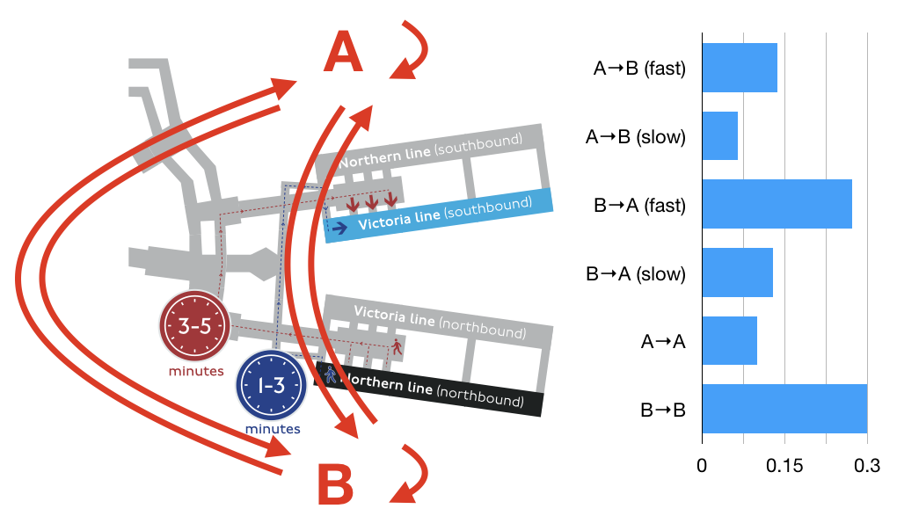

# MAC address tracking

This repository includes a Jupyter notebook to explore privacy preserving MAC address tracking. You can try it yourself by [opening it in Binder](https://mybinder.org/v2/gh/sjmurdoch/mactracking/master?filepath=tubemap.ipynb).

